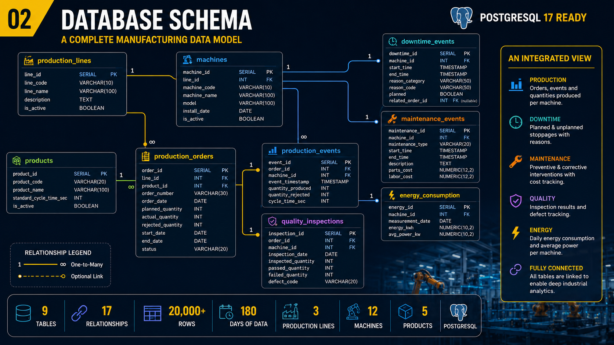

# Smart Factory SQL

### Learn SQL by investigating a manufacturing environment

[](https://www.postgresql.org/)
[](https://en.wikipedia.org/wiki/SQL)
[](https://en.wikipedia.org/wiki/Industry_4.0)

**Smart Factory SQL** is a hands-on educational project for learning
**PostgreSQL, SQL and manufacturing analytics** with a realistic
synthetic factory environment.

Instead of practicing SQL only with customers, movies or generic sales
tables, this project lets you investigate:

**production → machines → downtime → quality → maintenance → energy**

> **Mission:** use SQL to understand what is happening inside a factory.

------------------------------------------------------------------------

## Why this project?

Industrial data is rarely just one table.

A production problem may involve several interconnected sources:

-   production orders
-   production events
-   machines
-   production lines
-   downtime
-   quality inspections
-   maintenance
-   energy consumption

This project brings those concepts together in one relational model so
you can practice SQL against an **Industrial / Smart Factory scenario**.

------------------------------------------------------------------------

## 🏭 Manufacturing Environment

The complete dataset represents a fictional manufacturing company
operating across **three production lines**.

  Domain                        Complete dataset
  --------------------------- ------------------
  Production lines                         **3**
  Industrial machines                     **12**
  Products                                 **5**
  Production orders                    **1,143**
  Production events                   **17,167**
  Downtime events                         **82**
  Maintenance interventions                **8**
  Quality inspections                  **1,143**
  Energy measurements                  **2,172**

That's **20,000+ industrial observations** to investigate.

The data is **synthetic** and designed for education, training,
demonstrations and SQL practice.

------------------------------------------------------------------------

## 🗄️ Database Schema



The relational model connects the main manufacturing domains:

``` text
Production Lines
      │
      └── Machines
            │
            ├── Downtime Events
            ├── Maintenance Events
            └── Energy Consumption

Products
      │
      └── Production Orders
              │
              ├── Production Events
              └── Quality Inspections
```

The complete database contains **9 core tables** covering production,
machines, products, downtime, maintenance, quality and energy.

------------------------------------------------------------------------

## 🔎 What can you investigate?

### Production Analytics

-   Planned vs. actual production
-   Production by line
-   Fulfillment rate
-   Rejected quantity
-   Production trends
-   Production by product

### Quality Analytics

-   Reject rate
-   Defect rate
-   Failed inspections
-   Defect categories
-   Quality by production line
-   Quality by machine

### Maintenance & Reliability

-   Machine downtime
-   Planned vs. unplanned downtime
-   Downtime duration
-   Maintenance history
-   Preventive vs. corrective maintenance
-   Maintenance cost

### Machine Performance

-   Cycle time
-   Production rate
-   Machine performance over time
-   Machine degradation patterns

### Energy Analytics

-   Energy consumption
-   Average power
-   Energy trends
-   Energy per production activity
-   Machine energy efficiency

------------------------------------------------------------------------

## 🚀 Quick Start

This repository contains a **free learning sample** of the project.

You can explore the schema, run starter queries and work through
manufacturing investigation scenarios without needing an external API or
cloud service.

### Requirements

-   PostgreSQL 17 recommended
-   Basic SQL knowledge
-   A PostgreSQL client such as `psql`, pgAdmin or DBeaver

### Example

After loading the sample database and selecting the schema:

``` sql
SET search_path TO smart_factory;

SELECT
    pl.line_code,
    pl.line_name,
    SUM(po.actual_quantity) AS actual_quantity
FROM production_orders po
JOIN production_lines pl
    ON pl.line_id = po.line_id
GROUP BY
    pl.line_code,
    pl.line_name
ORDER BY actual_quantity DESC;
```

This query answers:

> **Which production line achieved the highest actual production?**

The important part is not only the SQL syntax. The query demonstrates a
common analytical pattern:

``` text
JOIN
  ↓
GROUP BY
  ↓
AGGREGATE
  ↓
ORDER BY
```

------------------------------------------------------------------------

## 🧪 Starter Investigations

Try answering these questions with SQL:

1.  Which production line is performing best?
2.  Which production line has the lowest fulfillment rate?
3.  Which machines generate the most downtime?
4.  Which machine has the longest average downtime event?
5.  Which line has the highest reject rate?
6.  Is production quality deteriorating over time?
7.  Which machines have the highest cycle times?
8.  How does machine performance change month by month?
9.  Which machines consume the most energy?
10. Does maintenance appear to improve machine performance?

Don't look for the answer first.

**Let the data tell you the story.**

------------------------------------------------------------------------

## 📁 Repository Contents

The repository is intentionally structured as a **free entry point** to
the complete dataset.

``` text
smart-factory-sql/
│
├── README.md
│
├── schema/
│   └── 02_database_schema.png
│
├── examples/
│   └── starter-queries.sql
│
├── sample-data/
│   ├── production_lines_sample.csv
│   ├── machines_sample.csv
│   └── products_sample.csv
│
└── challenges/
    └── README.md
```

> File names may evolve as the project grows. The repository focuses on
> learning resources and representative sample data rather than
> distributing the complete commercial dataset.

------------------------------------------------------------------------

## 📦 Want the Complete Dataset?

The **complete Smart Factory Manufacturing Dataset v0.1** contains the
full PostgreSQL database and all data required to reproduce the
manufacturing investigation environment.

### The complete package includes

-   PostgreSQL 17 full database dump
-   Complete CSV datasets
-   Dataset generator SQL
-   Data dictionary
-   Database schema documentation
-   Starter SQL queries
-   Industrial investigation challenges
-   README and educational documentation

### 💰 Get the complete dataset --- \$9

**[👉 Get Smart Factory Manufacturing Dataset v0.1 on
Gumroad](https://numbersedu.gumroad.com/l/smart-factory-manufacturing-dataset)**

------------------------------------------------------------------------

## 🎓 Who is this for?

-   SQL learners
-   PostgreSQL learners
-   Data analysts
-   Data engineers
-   Industrial engineers
-   Manufacturing engineers
-   Industry 4.0 students
-   Smart Factory students
-   University instructors
-   Manufacturing analytics practitioners
-   Developers building industrial data applications

------------------------------------------------------------------------

## 🧠 Skills you can practice

-   `SELECT`
-   `WHERE`
-   `JOIN`
-   `GROUP BY`
-   Aggregate functions
-   `CASE`
-   Date and time analysis
-   Subqueries
-   Common Table Expressions
-   Window functions
-   PostgreSQL-specific features
-   Relational data modeling
-   Manufacturing KPIs
-   Industrial data analysis

The goal is to move from:

**"Can I write SQL?"**

to:

**"Can I use SQL to investigate an industrial problem?"**

------------------------------------------------------------------------

## 🏭 Example Industrial Scenario

Imagine that a production manager tells you:

> **"One production line is underperforming. Find out why."**

The answer is not stored in one column.

You may need to investigate:

``` text
Production performance
        ↓
Reject rate
        ↓
Machine downtime
        ↓
Cycle time
        ↓
Quality inspections
        ↓
Maintenance history
        ↓
Energy consumption
```

This is where **Industrial SQL** becomes useful.

The database gives you the evidence.

**Your SQL gives you the answer.**

------------------------------------------------------------------------

## 🔗 Project Resources

-   **Complete dataset:**
    [Gumroad](https://numbersedu.gumroad.com/l/smart-factory-manufacturing-dataset)
-   **Industrial Smart Factory articles:** [Open Tech for Smart
    Manufacturing](https://opensource-smartfactory.blogspot.com/)
-   **Database schema:**
    [`schema/02_database_schema.png`](schema/02_database_schema.png)
-   **Starter SQL:**
    [`examples/starter-queries.sql`](examples/starter-queries.sql)

------------------------------------------------------------------------

## 📜 License

This repository contains educational material and representative sample
resources.

The **complete Smart Factory Manufacturing Dataset** is a commercial
educational product.

Please read [`LICENSE.txt`](LICENSE.txt) before using, modifying or
redistributing included material.

The complete dataset may **not** be resold, redistributed or repackaged
as a competing dataset without permission.

------------------------------------------------------------------------

## ⚠️ Data Disclaimer

This is a **synthetic educational dataset**.

The manufacturing company, machines, products, production records,
maintenance records, quality inspections and energy measurements are
fictional and were created for educational and analytical purposes.

The dataset does not represent real industrial operations or
confidential company information.

No warranty is provided regarding fitness for a particular industrial,
operational or commercial purpose.

------------------------------------------------------------------------

## 👤 About

**Open Tech for Smart Manufacturing**

Educational resources focused on:

**SQL · PostgreSQL · Industrial Data · Industry 4.0 · Smart Factory ·
Manufacturing Analytics**

------------------------------------------------------------------------

### ⭐ If you find the project useful

Star the repository, explore the examples, and share the project with
someone learning SQL or Industrial Data Analytics.

**Learn SQL. Investigate the factory. Find the story in the data.**
